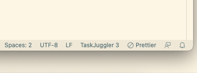
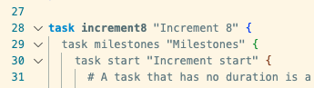

# tj3-language-support README

This extension adds language support for TaskJuggler 3 files, ending in `.tjp` and `.tji` (or manually selected). Currently the TextMate grammar is borrowed from [TJ3-syntax-sublimetext2](https://github.com/SublimeText/TJ3-syntax-sublimetext2).

## Features

* Basic language support for TaskJuggler 3 syntax

>Indication is added to the bottom status bar

> In-editor highlighting of task syntax

## Known Issues

* No support for formatting yet (needs language server)
* Some syntax highlighting missing (wishlist: convert textmate grammar from xml to json before adding syntax)

## Release Notes

Users appreciate release notes as you update your extension.

### 0.0.1

Alpha release

---
